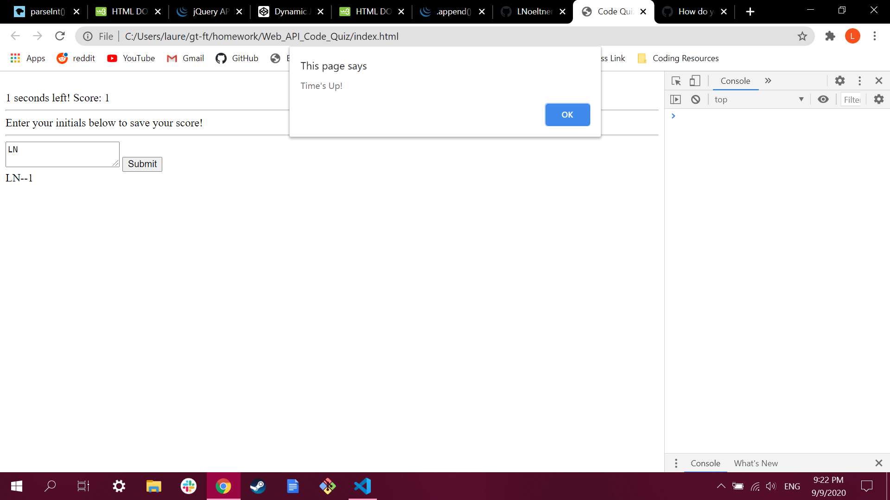

## Web API Code Quiz

In this project, I was tasked with greating a quiz that cycles between questions with JavaScript. We had to include a start button that would start a timer and display the first question, and upon answering the first question, the second question would take the place of the first question, and so on, until the questions have all been completed or the timer reaches 0. When the user aswers a question correctly, they will increase their score by 1. When the user answers a question incorrectly, 10 seconds will be subtracted from their remaining time. when the user finishes the quiz, a text box will appear and instructions on how to submit the user initials will appear in the question section. When the user types their initials into the text box and clicks the submit button, their initials and their score will appear below, separated by two dashes.

In doing this project, I learned much more about how to use functions, traversing the DOM with dot notation, using object arrays and the scoping of varibles. I also learned how to dynamically change the current content of my page solely using JavaScript and a very basic HTML script.

## Known Issues

1. When the user completes the quiz before time is up, they will recieve the final "congratulations" alert with their score once again when the timer runs out for a total of two identical alerts.

2. The initials inputted by the user and their final score will appear below the text box when clicking "Submit", but their information will not remain after a page reload.

## Links

## Screenshot of Page

## License

None. The project parameters were provided by my instructors at the Georgia Tech Coding Bootcamp in the form of a .gif showing the functionality of the quiz. Made in early September 2020.
